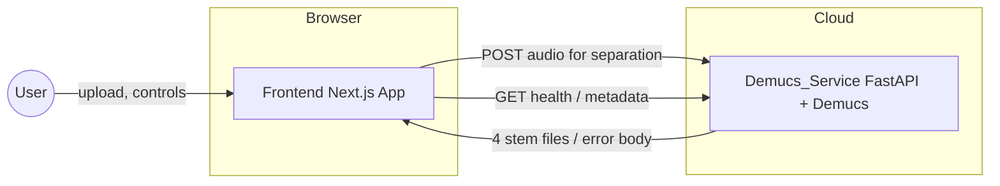
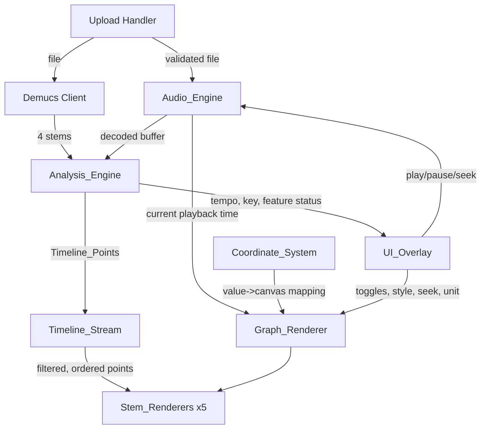
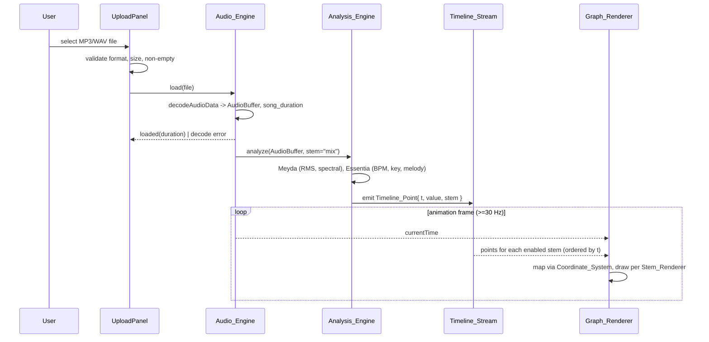
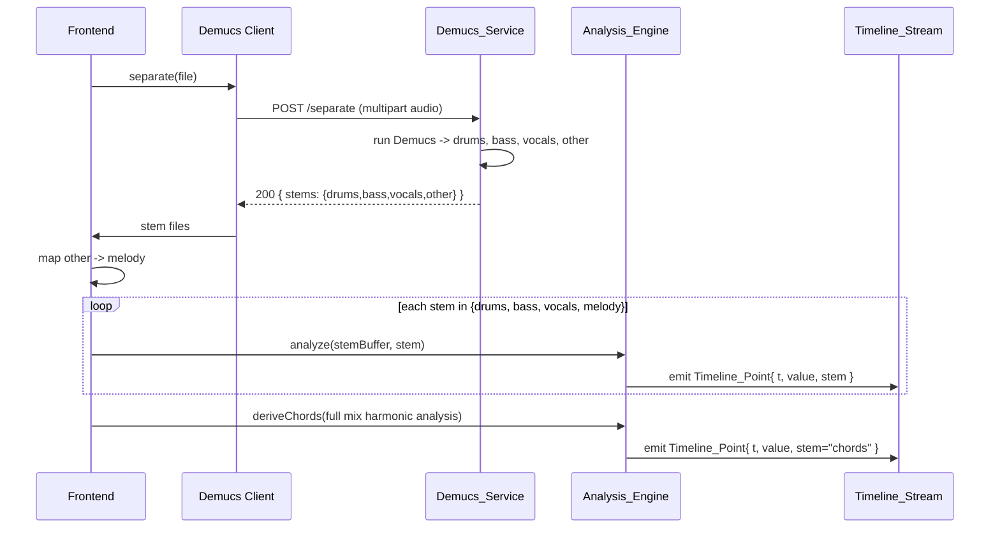

# Design Document

## Overview

Harmograph renders the musical components of a song as live, interactive mathematical graphs. A song is decoded and played in the browser, analyzed into per-stem feature streams, and drawn on a p5.js canvas where a shared horizontal axis represents playback time. Each musical stem (drums, melody, bass, vocals, chords) is mapped to its own animated graphical representation. Users upload an audio file, separate it into stems via a backend service, view per-stem analysis as animated graphs, toggle stems on and off, switch the visual style of each stem, and read out tempo and key information.

The system is split into two independently deployable artifacts:

1. **Frontend** — a Next.js 14 (App Router) + React + TypeScript application that handles upload, in-browser audio decode/playback (Web Audio API), feature analysis (Meyda.js + Essentia.js WASM), normalization to a shared `Timeline_Point` stream, and rendering (p5.js). Hosted on Vercel, styled with Tailwind CSS.
2. **Demucs_Service** — a Dockerized Python FastAPI microservice wrapping Facebook's Demucs model for stem separation. Deployed to Fly.io or Modal, reachable through a configurable network endpoint.

The architecture is **browser-first**: every audio processing task that can be performed in the browser is performed in the browser. The only data sent to the Demucs_Service is the audio file for stem separation, plus non-audio health/metadata requests.

This design covers the MVP. Spotify integration, user accounts, and saving/sharing graphs are out of scope.

### Key Design Decisions

| Decision | Rationale |
| --- | --- |
| Stem separation runs server-side, analysis runs client-side | Demucs requires a GPU/heavy CPU and a Python runtime; feature analysis (Meyda/Essentia WASM) runs cheaply in the browser, honoring browser-first processing (Req 12.4, 12.5). |
| Demucs `other` stem is mapped to `melody` | Demucs produces `drums`, `bass`, `vocals`, `other`. The melody most often lives in `other`. Mapping is a pure routing rule (Req 4.9). |
| `chords` derived from harmonic analysis, not separation | Demucs has no chord stem; chords come from Essentia.js harmonic/key analysis of the full mix (Req 4.10). |
| Single normalized data model `{ t, value, stem }` | One consistent interface lets any `Stem_Renderer` consume any stem (Req 10). |
| p5.js canvas behind a React `UI_Overlay` | Separates declarative React controls from the imperative animation loop, with explicit pointer-event routing (Req 11). |
| Configurable `Coordinate_System` with clamping | Lets the same normalized data be viewed in normalized or musical units while guaranteeing on-canvas coordinates (Req 9). |

## Architecture

### System Context



The Frontend and Demucs_Service are separate deployment artifacts (Req 12.1, 12.2). The Frontend reaches the service through a configurable endpoint, e.g. `NEXT_PUBLIC_DEMUCS_ENDPOINT` (Req 12.3).

### Frontend Subsystem Architecture



### Component Tree (React)

The React tree renders the `UI_Overlay` above the p5.js canvas. The canvas is mounted by a thin React wrapper but driven imperatively by the `Graph_Renderer`.

```
<App>                                  App Router root layout/page
 └─ <HarmographPage>                   client component, owns app state stores
     ├─ <CanvasStage>                  positions canvas + overlay in a stacking context
     │   ├─ <P5Canvas>                 React wrapper; mounts Graph_Renderer (imperative)
     │   │     └── Graph_Renderer      (non-React) p5 instance
     │   │           ├── Stem_Renderer[drums]
     │   │           ├── Stem_Renderer[melody]
     │   │           ├── Stem_Renderer[bass]
     │   │           ├── Stem_Renderer[vocals]
     │   │           └── Stem_Renderer[chords]
     │   └─ <UIOverlay>                higher stacking order than canvas
     │         ├─ <UploadPanel>        file picker + validation messages
     │         ├─ <PlaybackControls>   play / pause / seek
     │         ├─ <StemTogglePanel>
     │         │     └─ <StemToggle> x5 (one per Stem_Type)
     │         ├─ <GraphStylePanel>
     │         │     └─ <GraphStylePicker> x5 (per Stem_Type)
     │         ├─ <CoordinateUnitPicker>   y-axis: normalized | Hz | MIDI | dB
     │         ├─ <TempoKeyReadout>     tempo + key + pending/placeholder states
     │         └─ <StatusBanner>        analysis/separation/error messages
     └─ (state stores)                 playback, timeline index, stem config, analysis status
```

Non-React engines (`Audio_Engine`, `Analysis_Engine`, `Timeline_Stream`, `Coordinate_System`, `Graph_Renderer`, `Stem_Renderer`) are plain TypeScript modules instantiated and wired by `HarmographPage`. React state mirrors only what the overlay needs to display; the high-frequency animation loop reads engine state directly to avoid React re-render overhead.

### Data Flow

#### Primary flow: upload → decode → analyze → render



In the in-browser-only path, the full mix is analyzed and feature streams are routed to stems heuristically (RMS/spectral onsets → drums; melody pitch → melody; low-band energy → bass; vocal RMS → vocals; harmonic analysis → chords). This lets a graph appear without waiting on the server (Req 3).

#### Post-stem-separation flow



Demucs returns exactly four stems: `drums`, `bass`, `vocals`, `other`. The Frontend maps `other → melody` (Req 4.9), runs a per-stem analysis pass on each returned stem (Req 4.8), and derives `chords` from harmonic analysis of the mix rather than any separated stem (Req 4.10). Each per-stem analysis emits `Timeline_Point`s tagged with the resolved `Stem_Type`.

### API Contract: Frontend ⇄ Demucs_Service

Base URL is the configurable endpoint (Req 12.3). All audio is sent only for separation (Req 12.5); health/metadata carry no audio (Req 12.7).

#### `POST /separate`

Request:
- Content-Type: `multipart/form-data`
- Field `file`: the audio file (MP3 or WAV).

Success — `200 OK`:
```json
{
  "job_id": "b1c1f0e2-...",
  "duration_seconds": 213.4,
  "format": "wav",
  "stems": {
    "drums":  { "url": "/stems/b1c1f0e2/drums.wav",  "bytes": 18234112 },
    "bass":   { "url": "/stems/b1c1f0e2/bass.wav",   "bytes": 17110044 },
    "vocals": { "url": "/stems/b1c1f0e2/vocals.wav", "bytes": 16998230 },
    "other":  { "url": "/stems/b1c1f0e2/other.wav",  "bytes": 19002441 }
  }
}
```
Stem files are returned as URLs to download (or, alternatively, as a single `multipart/mixed` response). Each stem is a Supported_Audio_Format (WAV by default). The four keys are always `drums`, `bass`, `vocals`, `other` (Req 4.1).

Error responses — all return no stem files and a JSON body of the shape:
```json
{ "error": { "code": "STRING_CODE", "message": "human readable", "details": {} } }
```

| Condition | Status | `error.code` | Notes |
| --- | --- | --- | --- |
| Body is not a Supported_Audio_Format | `415 Unsupported Media Type` | `UNSUPPORTED_FORMAT` | `details.accepted = ["mp3","wav"]` (Req 4.2) |
| File exceeds max separation size | `413 Payload Too Large` | `FILE_TOO_LARGE` | `details.max_bytes` stated (Req 4.3) |
| Missing/empty file field | `400 Bad Request` | `INVALID_REQUEST` | (Req 4.2 family) |
| Separation failed during processing | `500 Internal Server Error` | `SEPARATION_FAILED` | (Req 4.4) |
| Processing exceeded max time | `504 Gateway Timeout` | `PROCESSING_TIMEOUT` | `details.timeout_seconds` (Req 4.5) |
| Service unavailable / resource exhaustion | `503 Service Unavailable` | `SERVICE_UNAVAILABLE` | covers OOM, no capacity (Req 4.6) |

#### `GET /health`

Returns `200 OK` with `{ "status": "ok", "model": "demucs", "version": "..." }` when the service is ready; non-2xx or no response indicates unreachable (Req 12.6, 12.7). Carries no audio.

#### `GET /meta` (optional metadata)

Returns service limits the Frontend can use to pre-validate, e.g. `{ "max_bytes": 104857600, "timeout_seconds": 600, "accepted": ["mp3","wav"] }`. Carries no audio (Req 12.7).

#### Frontend unreachable handling

When `POST /separate` cannot reach the service (network error, non-response), the Frontend displays "stem separation is unavailable" and retains the loaded file and its in-browser analysis (Req 12.6).

## Components and Interfaces

### Audio_Engine

Wraps Web Audio API (`AudioContext`, `decodeAudioData`, an `AudioBufferSourceNode` or `MediaElementAudioSourceNode`). Owns playback state and the authoritative `currentTime`.

```typescript
type LoadResult =
  | { ok: true; durationSeconds: number }
  | { ok: false; reason: "decode_failed" };

interface AudioEngine {
  load(file: File): Promise<LoadResult>;     // Req 1.1, 1.5, 1.6
  play(): void;                              // Req 2.1, 2.6
  pause(): void;                             // Req 2.2
  seek(timeSeconds: number): void;           // Req 2.3, 2.5 (clamped to [0, duration])
  getCurrentTime(): number;                  // Req 2.4 (>=30Hz via rAF/timeupdate)
  getDuration(): number;                     // Req 1.6
  isLoaded(): boolean;                       // Req 2.6
  onEnded(cb: () => void): void;             // Req 2.7
}
```

### Upload Handler / UploadPanel

Validates format, size, and non-emptiness before handing the file to the `Audio_Engine` and (on demand) the Demucs client.

```typescript
type UploadValidation =
  | { ok: true }
  | { ok: false; reason: "unsupported_format" | "too_large" | "empty"; message: string };

function validateUpload(file: File, maxBytes: number): UploadValidation; // Req 1.1-1.4
```

### Analysis_Engine

Runs Meyda.js (RMS + spectral envelope → drum onsets) and Essentia.js (tempo, key, melody pitch, chords). Produces normalized `Timeline_Point`s and a per-feature status.

```typescript
type FeatureName = "rms" | "spectral" | "tempo" | "key" | "melody" | "chords";

interface AnalysisStatus {
  pending: FeatureName[];
  succeeded: FeatureName[];
  failed: FeatureName[];               // Req 3.6
  tempoBpm: number | null;             // Req 8.1, 8.2
  key: { tonic: PitchClass; mode: "major" | "minor" } | null; // Req 8.3, 8.4
}

interface AnalysisEngine {
  analyze(buffer: AudioBuffer, stem: StemType | "mix"): Promise<void>; // Req 3.1-3.3, 4.8
  deriveChords(mixBuffer: AudioBuffer): Promise<void>;                 // Req 4.10
  getStatus(): AnalysisStatus;
  onTimelinePoint(cb: (p: TimelinePoint) => void): void;              // Req 3.4
}
```

Meyda is configured for windowed analysis (e.g. 512-sample buffers) producing `rms` and `amplitudeSpectrum`/`spectralFlux` for onset detection. Essentia (WASM) runs `RhythmExtractor2013` (BPM), `KeyExtractor` (key), `PredominantPitchMelodia` (melody), and `HPCP`/chord detection (chords). Each raw feature is normalized into `[-1, 1]` and emitted as a `Timeline_Point`. Partial failure still emits points for succeeded features (Req 3.7) and never unloads audio (Req 3.8).

### Timeline_Stream

The shared, normalized stream. Validates each candidate point, filters invalid ones, routes by `stem`, and guarantees non-decreasing `t` per subscriber.

```typescript
interface TimelineStream {
  emit(candidate: unknown): void;        // validates -> accept/reject (Req 10.4)
  subscribe(stem: StemType, cb: (p: TimelinePoint) => void): Unsubscribe; // Req 10.3
  getPoints(stem: StemType): readonly TimelinePoint[];  // ordered by t (Req 10.5)
}
```

A point is accepted only if it has numeric `t` and `value`, `stem` is a valid `StemType`, `t ∈ [0, songDuration]`, and `value ∈ [-1, 1]`; otherwise it is excluded and prior points are retained (Req 10.4). Per-stem buffers are kept sorted (insertion by `t`) so delivery is non-decreasing in `t` (Req 10.5).

### Coordinate_System

Pure mapping from data space to canvas space, configurable per axis, with clamping.

```typescript
type YUnit = "normalized" | "hz" | "midi" | "db";

interface CoordinateSystem {
  setSongDuration(d: number): void;       // x range [0, max(d,1)] (Req 9.1, 9.2)
  setYUnit(unit: YUnit): void;            // Req 9.4
  xToCanvas(tSeconds: number, canvasWidth: number): number;  // Req 9.1
  yToCanvas(value: number, canvasHeight: number): number;    // clamps first (Req 9.5)
  activeYRange(): [number, number];       // [-1,1] | [20,20000] | [0,127] | [-60,0]
}
```

y-axis ranges: normalized `[-1, 1]`, Hz `[20, 20000]`, MIDI `[0, 127]`, dB `[-60, 0]` (Req 9.3, 9.4). Any value outside the active range is clamped to the nearest bound before mapping (Req 9.5). x-range is `[0, song_duration]`, or `[0, 1]` when duration is `0` or `< 1s` (Req 9.1, 9.2).

### Graph_Renderer and Stem_Renderers

A single p5.js instance owns the draw loop. It positions the graph's x at the current/retained playback time (Req 5.1, 5.8) and delegates per-stem drawing to five `Stem_Renderer`s.

```typescript
interface StemRenderer {
  readonly stem: StemType;
  setEnabled(on: boolean): void;          // Req 6.1, 6.2
  setStyle(style: GraphStyle): void;      // Req 7.2, 7.5
  ingest(point: TimelinePoint): void;     // Req 5.7
  draw(p: p5, cs: CoordinateSystem, playheadX: number): void; // Req 5.2-5.6, 5.10
}

interface GraphRenderer {
  getStemRenderer(stem: StemType): StemRenderer;
  setCoordinateSystem(cs: CoordinateSystem): void; // Req 9.6
}
```

A `Stem_Renderer` renders nothing until it has received at least one `Timeline_Point` (Req 5.10, 6.5). Default styles per stem are defined in the Data Models section. Drums render falling balls under constant downward acceleration and reset to the top on kick onset (Req 5.2, 5.9).

### UI_Overlay

A React layer with a higher stacking order than the canvas (Req 11.1). It owns pointer-event routing: events on interactive controls are handled and not forwarded; events on empty regions are forwarded to the canvas (Req 11.2, 11.3). Implemented by giving the overlay container `pointer-events: none` and each interactive control `pointer-events: auto`, so empty-region events fall through to the canvas beneath.

It presents exactly five `Stem_Toggle`s (one per `StemType`, all enabled on load) regardless of separation/analysis state (Req 6.3, 6.4), a `Graph_Style` picker per stem listing all defined styles (disabling those whose data is not yet available) (Req 7.1, 7.3, 7.4), a y-unit picker, and the tempo/key readout with pending/placeholder states (Req 8.1-8.5).

### Demucs Client (Frontend)

Thin typed client over the API contract above. Handles `POST /separate`, `GET /health`, `GET /meta`, maps the `other` stem to `melody` on success, and surfaces unreachable/error states to the `StatusBanner`.

### Demucs_Service (Backend)

FastAPI app with `POST /separate`, `GET /health`, `GET /meta`. Validates content type and size, invokes Demucs (`htdemucs` 4-stem model), enforces a processing timeout, and returns the four stems or a structured error body. Packaged as a Docker image, deployable independently (Req 4.7, 12.1, 12.2).

## Data Models

### Core types

```typescript
type StemType = "drums" | "melody" | "bass" | "vocals" | "chords";

type DemucsStem = "drums" | "bass" | "vocals" | "other";

interface TimelinePoint {
  t: number;       // seconds, in [0, songDuration]
  value: number;   // normalized, in [-1, 1]
  stem: StemType;
}

type PitchClass = "C" | "C#" | "D" | "D#" | "E" | "F"
                | "F#" | "G" | "G#" | "A" | "A#" | "B";
```

### Stem routing

```typescript
// Req 4.9: Demucs 'other' maps to melody; chords are NOT from separation (Req 4.10).
const DEMUCS_TO_STEM: Record<DemucsStem, StemType> = {
  drums:  "drums",
  bass:   "bass",
  vocals: "vocals",
  other:  "melody",
};
```

### Default Graph Styles (Req 7.6)

```typescript
type GraphStyle =
  | "bouncing_balls"        // drums
  | "parametric_curve"      // melody
  | "sine_wave"             // bass
  | "rms_envelope"          // vocals
  | "stacked_curves";       // chords

const DEFAULT_STYLE: Record<StemType, GraphStyle> = {
  drums:  "bouncing_balls",      // Req 5.2, 5.9
  melody: "parametric_curve",    // Req 5.3
  bass:   "sine_wave",           // Req 5.4
  vocals: "rms_envelope",        // Req 5.5
  chords: "stacked_curves",      // Req 5.6
};
```

### Configuration

```typescript
interface AppConfig {
  maxUploadBytes: number;        // 104_857_600 (Req 1.3)
  maxAnalysisMs: number;         // Req 3.5
  plausibleTempo: [number, number]; // [40, 250] (Req 8.1, 8.2)
  demucsEndpoint: string;        // configurable (Req 12.3)
}
```

### Stem configuration (UI state)

```typescript
interface StemConfig {
  enabled: boolean;              // default true on load (Req 6.4)
  style: GraphStyle;             // default per DEFAULT_STYLE (Req 7.5)
}
type StemConfigMap = Record<StemType, StemConfig>; // exactly 5 entries (Req 6.3)
```

## Correctness Properties

*A property is a characteristic or behavior that should hold true across all valid executions of a system — essentially, a formal statement about what the system should do. Properties serve as the bridge between human-readable specifications and machine-verifiable correctness guarantees.*

These correctness properties apply to Harmograph's **pure logic layer**: upload validation, the time-domain seek clamp, `Timeline_Point` validation/normalization, timeline routing and ordering, stem mapping, the `Coordinate_System` mapping and clamping, render-gating, toggle/style resolution, and tempo/key readout formatting. The browser decode/playback, third-party feature extraction (Meyda/Essentia), p5.js visual rendering, the Demucs service behavior, and deployment concerns are covered by integration, example, and smoke tests in the Testing Strategy rather than property tests.

### Property 1: Upload validation classifies any file deterministically

*For any* file (arbitrary size including zero, arbitrary format/extension) and configured `maxBytes`, `validateUpload` returns `ok: true` if and only if the format is a Supported_Audio_Format, the size is greater than zero, and the size is at most `maxBytes`; otherwise it returns `ok: false` with the reason `empty` for zero bytes, `unsupported_format` for a non-MP3/WAV format, and `too_large` for a size exceeding `maxBytes`.

**Validates: Requirements 1.2, 1.3, 1.4**

### Property 2: Seek position is always clamped into the playback range

*For any* requested seek time and song duration, the resulting playback position lies within `[0, duration]`, equals the requested time when the requested time is already inside the range, and equals the nearest boundary otherwise.

**Validates: Requirements 2.3, 2.5**

### Property 3: Every emitted Timeline_Point satisfies the normalized data model

*For any* raw feature sample produced by analysis, the resulting `Timeline_Point` accepted onto the Timeline_Stream has a numeric `t` within `[0, songDuration]`, a numeric `value` within `[-1, 1]`, and a `stem` equal to exactly one of the five `Stem_Type` values.

**Validates: Requirements 3.4, 10.1, 10.2**

### Property 4: Invalid candidates are excluded and prior points retained

*For any* sequence of emitted candidates where some candidates are invalid (missing `t`, `value`, or `stem`; a `stem` not among the five Stem_Types; or a `t` or `value` outside its defined range), the Timeline_Stream contains exactly the valid candidates, and every previously accepted point remains present.

**Validates: Requirements 10.4**

### Property 5: Demucs stems route correctly and chords never come from separation

*For any* Demucs stem in `{drums, bass, vocals, other}`, the stem-routing map yields a `Stem_Type` in `{drums, bass, vocals, melody}`, with `other` always mapping to `melody`; no Demucs stem maps to `chords`.

**Validates: Requirements 4.9, 4.10**

### Property 6: Each returned stem triggers exactly one analysis pass

*For any* set of stems returned by the Demucs_Service, the Frontend dispatches exactly one Analysis_Engine pass per returned stem, each tagged with the routed `Stem_Type`.

**Validates: Requirements 4.8**

### Property 7: Subscribers receive only their stem's points

*For any* list of Timeline_Points and any `Stem_Type`, a subscriber for that stem receives exactly the subset of points whose `stem` field equals that type, and no others.

**Validates: Requirements 10.3**

### Property 8: Points are delivered in non-decreasing time order

*For any* emission order of valid Timeline_Points for a stem, the points delivered to (and stored for) that stem's subscriber are ordered non-decreasing by their `t` field.

**Validates: Requirements 10.5**

### Property 9: Partial analysis failure does not suppress succeeded features

*For any* subset of features marked as failed, the Analysis_Engine still emits Timeline_Points for every feature that succeeded.

**Validates: Requirements 3.7**

### Property 10: Coordinate mapping selects correct ranges and clamps to canvas

*For any* data value, song duration, active y-unit, and canvas dimensions: the x-range is `[0, duration]` when `duration >= 1` and `[0, 1]` when `duration < 1`; the active y-range is `[-1, 1]` for normalized, `[20, 20000]` for Hz, `[0, 127]` for MIDI, and `[-60, 0]` for dB; `yToCanvas(value)` equals `yToCanvas(clamp(value, activeYRange))`; and every mapped x and y coordinate lies within the canvas bounds.

**Validates: Requirements 9.1, 9.2, 9.3, 9.4, 9.5**

### Property 11: A stem with no points renders no element

*For any* Stem_Renderer whose received-point buffer is empty (whether never populated or enabled before any point arrived), drawing produces no graphical element for that stem.

**Validates: Requirements 5.10, 6.5**

### Property 12: Toggling a stem affects only that stem

*For any* enabled/disabled configuration across the five stems (where disabled stems have points available), the set of stems that render a graphical element equals exactly the set of enabled stems that have at least one point; toggling one stem changes only that stem's rendered/not-rendered status and leaves every other stem's output unchanged.

**Validates: Requirements 6.1, 6.2**

### Property 13: The toggle set always covers exactly the five stems

*For any* separation and analysis state, the set of Stem_Toggles presented has exactly one entry per `Stem_Type` and no others.

**Validates: Requirements 6.3**

### Property 14: An unselected stem resolves to its table default style

*For any* `Stem_Type` for which the user has made no explicit style selection, the active Graph_Style equals the single default defined for that stem in the Default Graph Styles table.

**Validates: Requirements 7.5, 7.6**

### Property 15: Tempo readout reflects plausibility

*For any* estimated tempo, the readout equals the tempo rounded to the nearest integer beats per minute when the tempo is within `[40, 250]`, and equals the "could not be determined" placeholder otherwise.

**Validates: Requirements 8.1, 8.2**

### Property 16: Key readout formats valid keys and placeholders otherwise

*For any* key estimate, when the key is a valid `{tonic, mode}` the readout shows one of the twelve chromatic pitch classes together with `major` or `minor`; when the key is absent the readout shows the "could not be determined" placeholder while leaving any displayed tempo unchanged.

**Validates: Requirements 8.3, 8.4**

### Property 17: Drum balls fall under constant acceleration and reset on kick onset

*For any* sequence of time steps with no intervening kick onset, each drum ball's vertical position is non-decreasing (moving downward) consistent with constant downward acceleration; and *for any* set of ball positions, a kick onset resets every ball to the top of the active y-axis range.

**Validates: Requirements 5.2, 5.9**

## Error Handling

### Upload errors (Frontend)
- Non-MP3/WAV, oversize, empty, and undecodable files are rejected before reaching the `Audio_Engine`; each produces a specific user-facing message (accepted formats / max size / empty / decode failure) (Req 1.2–1.5).
- Validation precedence is deterministic: emptiness and format/size are decided by `validateUpload` (pure), decode failure is decided by the decoder (Req 1.5).

### Analysis errors (Frontend)
- Full failure or timeout shows an "analysis failed" message; the loaded file stays playable (Req 3.5, 3.8).
- Partial failure shows which features failed while still emitting points for succeeded features (Req 3.6, 3.7).
- Malformed candidate points are silently excluded from the Timeline_Stream; previously accepted points are retained (Req 10.4).

### Demucs_Service errors
- Structured JSON error body `{ error: { code, message, details } }` for every failure path, with status codes: `415` unsupported format, `413` too large, `400` invalid request, `500` separation failed, `504` timeout, `503` unavailable/resource exhaustion (Req 4.2–4.6). No stem files are returned on any error.

### Connectivity errors (Frontend ⇄ Service)
- If `POST /separate` cannot reach the service, the Frontend shows "stem separation is unavailable" and retains the loaded file plus its in-browser analysis; the in-browser graph continues to function (Req 12.6).

### Coordinate / data safety
- Out-of-range values are clamped before mapping so no draw call receives an off-canvas coordinate (Req 9.5).
- Seek requests outside `[0, duration]` are clamped rather than rejected (Req 2.5).

## Testing Strategy

### Property-Based Tests
- Library: **fast-check** (TypeScript), integrated with the project test runner (Vitest/Jest).
- Each property in the Correctness Properties section is implemented as a **single** property-based test running a **minimum of 100 iterations**.
- Each test is tagged with a comment referencing its design property in the format:
  `// Feature: harmograph, Property {number}: {property_text}`
- Generators: arbitrary `File`-like descriptors (size, MIME/extension), raw feature samples, `Timeline_Point` lists (valid and deliberately malformed), durations (including `0` and `< 1`), y-units, canvas dimensions, stem enable/style configurations, tempos (in and out of `[40, 250]`), and key estimates. Pure modules (`validateUpload`, `TimelineStream`, `CoordinateSystem`, stem routing, style/tempo/key resolution, drum physics) are tested directly; the `Analysis_Engine` dispatch property uses a mocked engine to keep iterations cheap.

### Unit / Example Tests
- Playback lifecycle: play-from-zero default, pause-retain, play-with-no-file guard, end-of-song suspend (Req 2.1, 2.2, 2.6, 2.7).
- Stem-style picker presence, listing, disabled-when-data-missing, and applying a selection (Req 7.1–7.4).
- Key-absent placeholder with retained tempo, pending indicators (Req 8.4, 8.5).
- Coordinate mapping change applied to subsequent frames (Req 9.6); style applied to subsequent frames (Req 7.2).
- Toggle initialization all-enabled on load (Req 6.4).
- Visual style behaviors for melody/bass/vocals/chords via renderer state assertions or snapshots (Req 5.3–5.6, 5.7).

### Integration Tests
- Browser audio: load a real MP3/WAV → duration > 0; corrupt file → decode error (Req 1.1, 1.5, 1.6); `getCurrentTime` cadence ≥ 30 Hz (Req 2.4); playhead tracks time within 100 ms and holds while paused (Req 5.1, 5.8).
- Meyda/Essentia produce RMS, spectral/onset, tempo, key, melody points on a known sample (Req 3.1–3.3).
- Demucs_Service API tests (against the running container or a mock): 4-stem success body; `415/413/400/500/504/503` error paths with correct bodies (Req 4.1–4.6).
- Pointer-event routing: control events not forwarded, empty-region events forwarded; overlay stacking order above canvas (Req 11.1–11.3).
- Connectivity: unreachable service → message + retained file/analysis (Req 12.6); health/meta carry no audio (Req 12.5, 12.7).

### Smoke Tests
- Frontend builds and deploys independently of the Demucs_Service (Req 12.1).
- Demucs_Service Docker image builds and `GET /health` responds standalone (Req 4.7, 12.2).
- Frontend honors the configured `demucsEndpoint` (Req 12.3).

### Test Configuration Summary
- Property tests: fast-check, ≥ 100 iterations each, tagged to design properties.
- Property tests verify universal invariants; unit/example tests verify concrete scenarios and edge cases; integration tests verify browser, third-party, service, and DOM behavior; smoke tests verify configuration and deployment.
